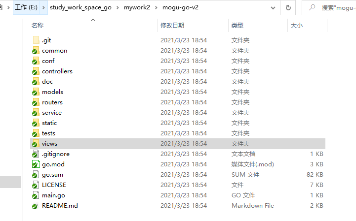
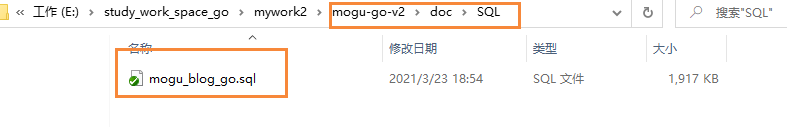
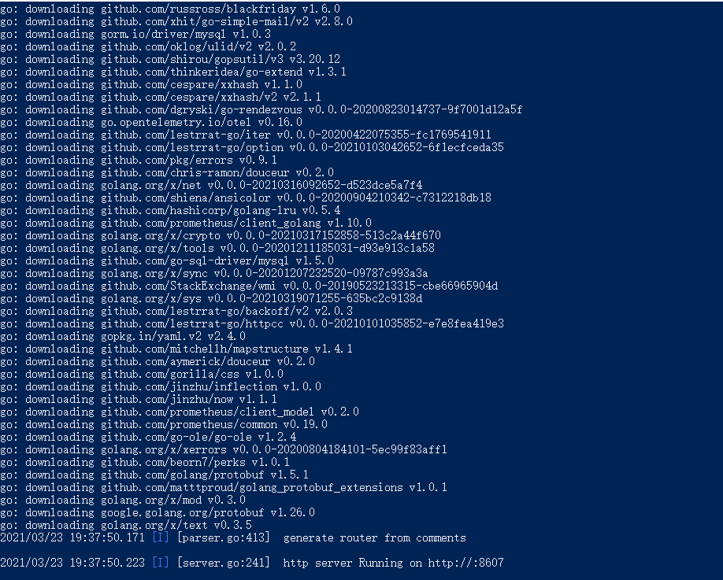
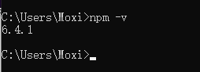
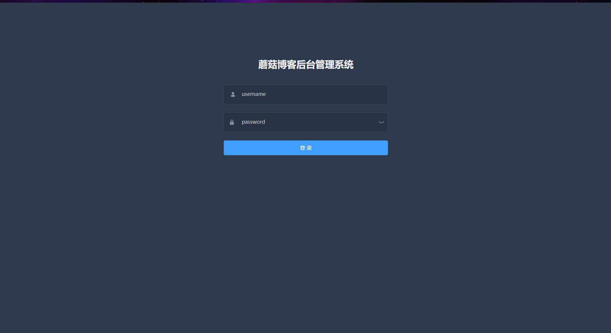
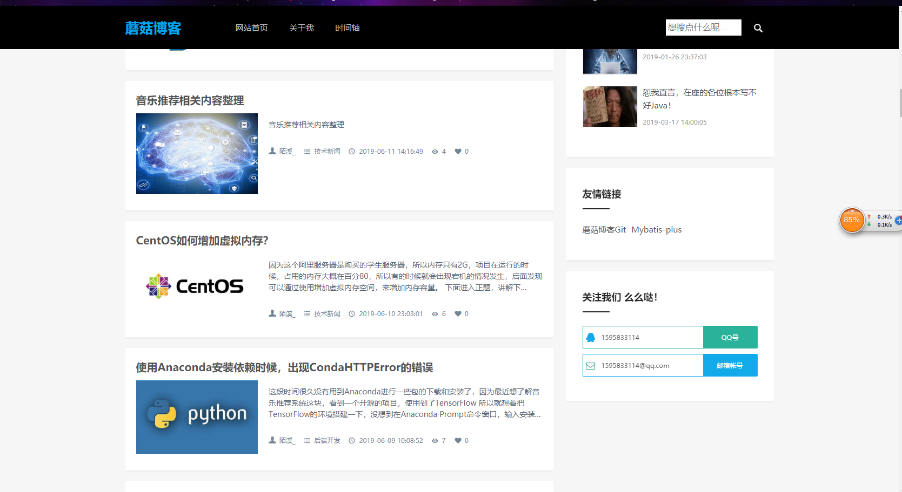
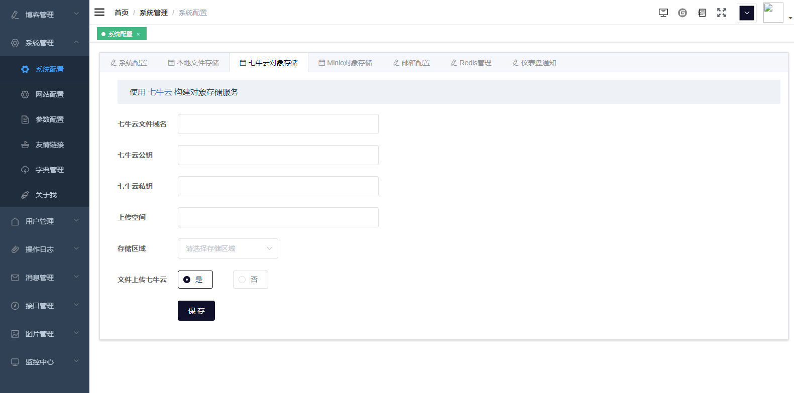

# mogu-go-v2

## 介绍

根据 **Java** 开源微服务博客：[蘑菇博客](http://gitee.com/moxi159753/mogu_blog_v2) 改编的一个 **Golang** 简化版分支，实现了大部分基础功能，前端后数据库基本上没有改动，可以直接使用蘑菇博客原版的前端和数据库脚本。目前尚存在一些问题，后续将陆续完善。争取成为国内一个较为优秀的 **Golang** 博客和内容管理系统。基本框架才用简单易用的 **beego**，**orm** 框架采用国内广泛采用的 **gorm**。

因最近老林没有继续维护蘑菇 **Go** 版，因此特意 **clone** 项目后继续完善~。 

## 官方网址

[蘑菇博客GO](http://mogu-go.com)

## 安装教程

### 拉取代码

陌溪前两天为了测试，特意 **fork** 了老林的 **mogu-go-v2** 仓库，同时解决了目前存在的一些问题，因此小伙伴们在拉取代码的时候，可以使用 **git** 命令直接拉取我 **fork** 的仓库。

```bash
git clone https://gitee.com/moxi159753/mogu-go-v2.git
```

下图是拉取仓库后的样子



### 修改配置

首先我们需要修改项目的配置文件，找到 **mogu-go-v2/conf/app.conf** 文件，首先修改 **dev** 环境的配置

```bash
#以下是mysql，redis和文件上传临时目录,根据环境切换
[dev]
#mysql配置
mysqlurls = "localhost:3306"
mysqladmin="root"
mysqlpwd="root"
mysqldb="mogu_blog_go"
#redis密码
redisConn="localhost:6379"
redisPwd=""

fileUploadPath="D:\mogu_blog\data"
data_website_url=http://localhost:9527
data_web_url=http://localhost:8607
```

将 **mysql** 和 **redis** 配置修改成自己环境中对应的账号和密码

同时还需要到 **mogu-go-v2/doc/SQL** 目录下，导入 **MySQL** 数据库脚本



### 后台项目启动

在启动项目前，我们需要确保 **redis** 和 **mysql** 已经配置无误，同时安装了 **Golang** 运行环境

关于 **Golang** 环境的安装，这里就不展开叙述，可以参考这篇文章

> Go语言的安装：http://moguit.cn/#/info?blogOid=27

完成上述操作后 **mogu-go-v2** 根目录，打开 **cmd** 执行窗口。同时因为 **Golang** 在获取依赖的时候，经常会出现 timeout，因此可以设置一下代理

```bash
go env -w GO111MODULE=on
go env -w GOPROXY=https://goproxy.io,direct
```

设置完成代理后，即可开始运行程序

```bash
go run main.go
```

运行的过程中，即会进行依赖的安装，项目启动完成后运行在 **8607** 端口，如下图所示



### 前台项目启动

#### 安装环境

前端项目使用的是 **Vue** 编写的，所以在这之前，需要下载好nodejs，因为 **nodejs** 里的 **npm** 模块是用于管理vue项目中的依赖，就类似于 **maven** 一样

> node官网：https://nodejs.org/en/

在安装的时候，记得选择好加入到环境变量中，这样我们就能在任何使用了。

查看是否安装成功： **npm -v**



#### 拉取代码

因为 **mogu-go-v2** 只包含了蘑菇博客的 **Golang** 后台，因此前端代码还是使用的蘑菇博客下的，所以需要拉取蘑菇博客的代码仓库。

```bash
https://gitee.com/moxi159753/mogu_blog_v2
```

### 启动 vue_mogu_admin

进入vue_mogu_admin 文件夹内，使用下面命令进行安装

```bash
# 使用淘宝镜像源进行依赖安装，解决国内下载缓慢的问题(出现警告可以忽略)
npm install --registry=https://registry.npm.taobao.org

# 启动项目
npm run dev

#打包项目（在部署的时候才需要使用）
npm run build
```

强烈建议不要用直接使用 cnpm 安装，会有各种诡异的 bug，可以通过重新指定 registry 来解决 npm 安装速度慢的问题。若还是不行，可使用 [yarn](https://github.com/yarnpkg/yarn) 替代 `npm`。

Windows 用户若安装不成功，很大概率是`node-sass`安装失败，[解决方案](https://github.com/PanJiaChen/vue-element-admin/issues/24)。

```
# 指定node-sass的国内镜像源
npm i node-sass --sass_binary_site=https://npm.taobao.org/mirrors/node-sass

# 重新安装
npm install --registry=https://registry.npm.taobao.org
```

另外因为 `node-sass` 是依赖 `python`环境的，如果你之前没有安装和配置过的话，需要自行查看一下相关安装教程。在启动项目成功后，会跳转到：[http://localhost:9528](http://localhost:9528/) ，我们输入账号密码： admin, mogu2018 访问即可



### 启动 vue_mogu_web

这个步骤其实和admin端的安装时一致的，这里就不做过多的叙述

```bash
# 使用淘宝镜像源进行依赖安装，解决国内下载缓慢的问题(出现警告可以忽略)
npm install --registry=https://registry.npm.taobao.org

# 启动项目
npm run dev

#打包项目（在部署的时候才需要使用）
npm run build
```

下面是启动成功的界面，跳转到：[http://localhost:9527](http://localhost:9527/)



注意，如果登录后没有图片显示，那么我们需要进入到后台管理，配置一下**七牛云**文件存储，参考下面博客

> 蘑菇博客配置七牛云：http://www.moguit.cn/#/info?blogOid=202

目前暂不支持 本地存储和 Minio存储



配置完成后，我们到图片管理上传对应的图片即可~

## 部署教程

1.  bee pack -be GOOS=linux打包
2.  自行修改conf配置文件中，其中runmode = dev适合开发环境，prod适合生产环境
3.  nohup运行 nohup ./mogu-go-v2 &

#### 使用说明

博客使用可以参考[蘑菇博客原版](http://gitee.com/moxi159753/mogu_blog_v2)的文档和教程

#### 参与贡献

1.  Fork 本仓库
2.  新建 Feat_xxx 分支
3.  提交代码
4.  新建 Pull Request


